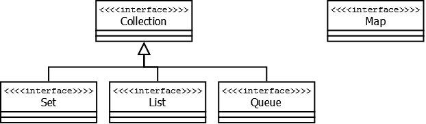

# Остальные коллекции
## Профессия Java-разработчик на Hexlet
### Преподаватель: Яковлев Егор
<!-- _color: white -->
<!-- _color: white -->

---

# Вопросы к лекции:

* Какие вообще существуют коллекции в Java?
* Какие бывают Maps в Java?
* Какие бывают Sets в Java?

---

# План

1. Collections
2. Map: LinkedHashMap, TreeMap
3. Set: HashSet, LinkedHashSet, TreeSet


---

# Collections



---

# Map


---

# LinkedHashMap

LinkedHashMap — это упорядоченная реализация хэш-таблицы. Здесь, в отличии от HashMap, порядок итерирования равен порядку добавления элементов.
["Статья о LinkedHashMap"](https://habr.com/ru/post/129037/)

**Демо**

---

# TreeMap

TreeMap — реализация Map основанная на деревьях. Как и LinkedHashMap является упорядоченной.

**Демо**

---

# Set


---

# HashSet

HashSet — реализация интерфейса Set, базирующаяся на HashMap. Внутри использует объект HashMap для хранения данных. В качестве ключа используется добавляемый элемент, а в качестве значения — объект-пустышка (new Object()).

**Демо**

---

# LinkedHashSet

LinkedHashSet — отличается от HashSet только тем, что в основе лежит LinkedHashMap вместо HashMap. Благодаря этому отличию порядок элементов при обходе коллекции является идентичным порядку добавления элементов.

**Демо**

---

# TreeSet

TreeSet — аналогично другим классам-реализациям интерфейса Set содержит в себе объект NavigableMap, что и обуславливает его поведение. Предоставляет возможность управлять порядком элементов в коллекции при помощи объекта Comparator, либо сохраняет элементы с использованием "natural ordering".

**Демо**

---

# Домашнее задание

```bash
hexlet program download java other-collections
hexlet program submit java other-collections
```

---

# Вопросы?