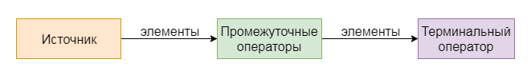

# Streams
## Профессия Java-разработчик на Hexlet
### Преподаватель: Яковлев Егор
<!-- _color: white -->
<!-- _color: white -->

---

# Вопросы к лекции

* Функциональный стиль в обработке данных? Как?
* Что такое Stream?
* Какие есть методы у Stream?

---
# План

1. Stream API
2. Получение объекта Stream
3. Операторы
4. Примеры

---

# Stream API

> Stream API это новый способ работать со структурами данных в функциональном стиле

Stream — это объект для универсальной работы с данными. 

Коллекция - источник объектов

**Демо**

---

# Получение объекта Stream

```java
list.stream()

map.entrySet.stream()

Arrays.stream(array)

Stream.of(1, 2, 3)
```

---

# Операторы



* промежуточные (конвейерные): map, filter, ...
* терминальные: forEach, collect, ...

Количество конвейреных методов - не ограничено, терминальный метод - один
Все конвейерные методы выполняются **лениво**

**Демо**


---

# Примеры

**Демо**

---

# Домашнее задание
 
```bash
hexlet program download java streams

hexlet program submit java streams
```

---

# Вопросы?