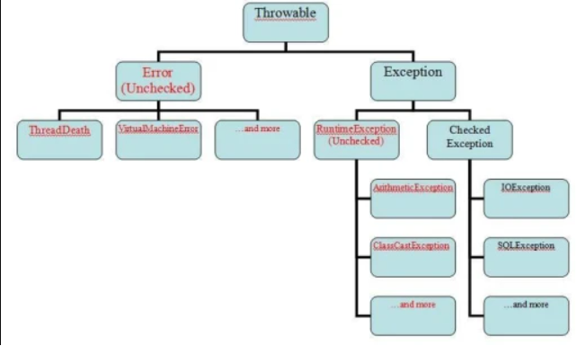

# Ошибки
## Профессия Java-разработчик на Hexlet
### Преподаватель: Яковлев Егор
<!-- _color: white -->
<!-- _color: white -->

---

# Вопросы к лекции:

* 


---

# План

1. 

---

# intro

* Исключение - возникновение ошибок и непредвиденных ситуаций при выполнении программы.

---

# Когда могут возникать исключения?

* неправильные действия пользователя
* отсутвие необходимого ресурса на диске
* потеря соединения с сервером
* неправильное использование API

---

# Иерархия исключений



---

# Домашнее задание

```bash
hexlet program download java errors
hexlet program submit java errors
```

---

# Вопросы?