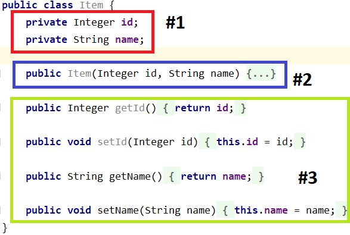

# Классы и объекты
## Профессия Java-разработчик на Hexlet
### Преподаватель: Яковлев Егор
<!-- _color: white -->
<!-- _color: white -->

---

# Вопросы к лекции:

* Что есть шаблон для объекта в ООП ЯП?
* Как создать объект класса?
* Как классы могут быть связанны друг с другом?

---

# План

* intro
* Класс
* Конструктор
* UML

---

# Intro

Java – это объектно-ориентированный язык программирования. Программы состоят из объектов, которые как-то связываются между собой. Результат работы программы – результат взаимодействия объектов

---

# Класс

* Класс – шаблон для объекта
* Каждый объект является объектом какого-то класса

---

# Класс



---

# Конструктор

Конструктор – это специальный метод, который вызывается при создании нового объекта

```java
public class Car {
    private Integer id;
    private String name;

    Car(Integer id, String name) {
        this.id = id;
        this.name = name;
    }
}
```

---

# Конструктор. Что, как и зачем?

* Диктует, как объект класса может быть создан
* Содержит в себе инициализацию переменных класса
* Инициализирует объект непосредственно во время создания
* В отличии от метода, конструктор ничего не возвращает
* Если явного конструктора нет, создаётся пустой конструктор

---

# Конструктор

**Демо**

---

# UML

UML – это язык графического описания для объектного моделирования в области разработки программного обеспечения, моделирования бизнес-процессов, системного проектирования и отображения организационных структур

[UML диаграммы](https://ru.wikipedia.org/wiki/UML)

[UML и отношения классов](https://habr.com/ru/post/150041/)
