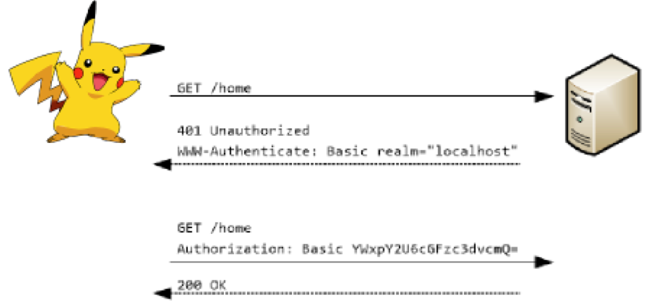
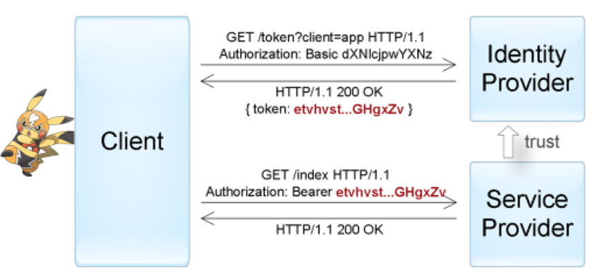
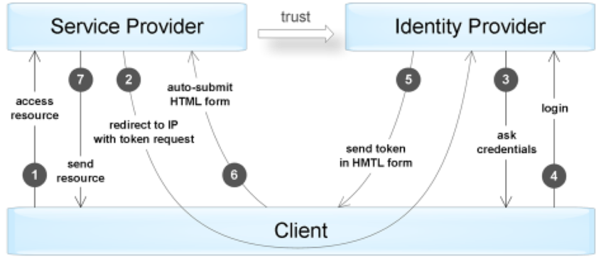

# Authentication
## Профессия Java-разработчик на Hexlet
### Преподаватель: Яковлев Егор
<!-- _color: white -->
<!-- _color: white -->

---

# Вопросы к лекции

* 

---
# План

1. 


---

# Аутентификация

Аутентификация - процедура проверки подлинности

---

# Аутентификация

Примеры:

* проверка подлинности пользователя путём сравнения введённого им пароля (для указанного логина) с паролем, сохранённым в базе данных пользовательских логинов;
* подтверждение подлинности электронного письма путём проверки цифровой подписи письма по открытому ключу отправителя;
* проверка контрольной суммы файла на соответствие сумме, заявленной автором этого файла.

---

# Виды аутентификации

* Basic auth
* Token auth

[Аутентификация](https://habr.com/ru/company/dataart/blog/311376/)

---

# Basic auth



---

# Token auth



---

# Token auth



---

# Аутентификация

**Демо**

---
# Домашнее задание
 
```bash
hexlet program download java authentication
hexlet program submit java
```

---

# Вопросы?