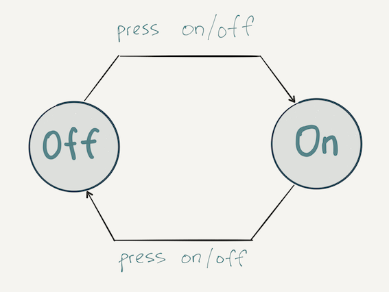
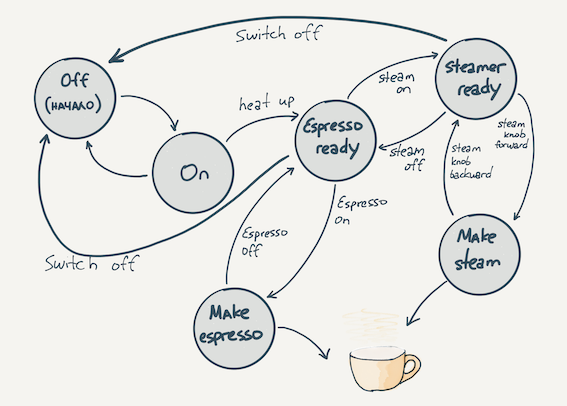

# Конечный автомат
## Профессия Java-разработчик на Hexlet
### Преподаватель: Яковлев Егор
<!-- _color: white -->
<!-- _color: white -->

---

# Вопросы к лекции

* Что такое конечный автомат?
* Где встречается конечный автомат?
* Как реализуется пример конечного автомата?

---
# План

1. Конечный автомат
2. Примеры

---

# Конечный автомат

1. Модель, с помощью которой удобно представлять процесс, 
имеющий конечное число дискретных управляющих состояний.

2. некоторая абстрактная модель, содержащая конечное число состояний чего-либо. Используется для представления и управления процессом выполнения каких-либо команд.

---

# Конечный автомат

Обратим внимание, что:

* процесс
* состояние
* дискретные состояния
* управляющие состояния

---

# Примеры



---

# Примеры



---

# Еще примеры

* состояние заказа
* светофор
* активация сим-карты

---

# Демо

**Практика**

---
# Домашнее задание
 
```bash
hexlet program download java finite-state-machine
hexlet program submit java
```

---

# Вопросы?