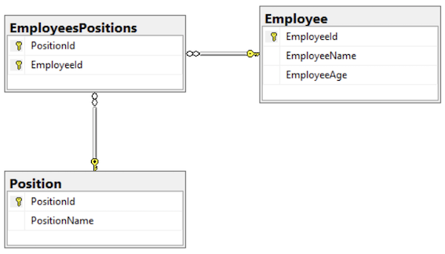

# Relations
## Профессия Java-разработчик на Hexlet
### Преподаватель: Яковлев Егор
<!-- _color: white -->
<!-- _color: white -->

---

# Вопросы к лекции

* Что такое связь?
* Какие бывают связи?
* Как создавать связи в Spring-е?

---
# План

1. Создание связи
2. Виды связей
3. Many-to-many
4. One-to-many
5. One-to-one
6. Практика

---

# Создание связи

Связи создаются с помощью внешних ключей (foreign key).
Внешний ключ — это атрибут или набор атрибутов, которые ссылаются на primary key или unique другой таблицы.

---

# Виды связей

* many-to-many
* one-to-many
* one-to-one

---

# many-to-many



---

# one-to-many


---

# one-to-one


---

# Практика

**Демо**


---
# Домашнее задание
 
```bash
hexlet program download java relations
hexlet program submit java
```

---

# Вопросы?