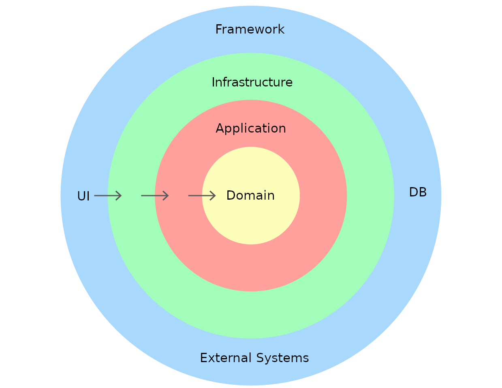

# Service layer
## Профессия Java-разработчик на Hexlet
### Преподаватель: Яковлев Егор
<!-- _color: white -->
<!-- _color: white -->

---

# Вопросы к лекции:

* Существует ли единственно верный подход организации приложения?
* Какие есть принципы проектирования архитектуры?
* Какие есть слои архитектуры?

---

# План

1. Вопросы при проектировании приложения
2. Принципы архитектуры
3. Архитектура
4. Слои архитектуры

---

# Архитектура

* Как правильно организовать код приложения?
* Какую выбрать архитектуру?

---

# Архитектура

Не существует единственно верного подхода при организации приложения

---

# Архитектура

* Изоляция побочных эффектов
* Хорошая абстракция (абстракция данных, композиция, разделение)
* Слабые связи (возможности замены/независимого развития)
* Сильные барьеры (между абстракциями)

---

# Барьер абстракции

**Барьеры абстракции** или **принцип одного уровня абстракции** означает, что работая в одно предметной области на определённом срезе, оперируют объектами только этого среза, избегая объектов, к нему не относящихся

---

# Архитектура

Все архитектуры сводятся к тому, что наше приложение представляет из себя набор слоёв (тех самых абстракций), которые связаны друг с другом определённым образом и отвечают за определённые аспекты системы

---

# Архитектура

---

# Домен

Это реализация вашей модели предметной области. Только бизнес логика без реализации инфраструктуры

* Чистый код
* Plain Old X Object (POXO)
* Бизнес-логика
* Валидации

---

# Персистентность

Нужно сохранить изменения. Состояние, его изменение и поддержка целостности – сложная процедура. Придуманы огромные и сложные фреймворки, называемые ORM

---

# Репозиторий

Репозиторий – это хранилище однотипных сущностей. Позволяет как делать выборки, так и сохранять сущности внутри себя. Для простоты в нашем приложении репозитории будут хранить все данные в памяти

---

# Инфраструктура

В эту категорию попадает фреймворк, UI и вообще любая прикладная история. На картинке этот слой находится на самой внешней стороне. Из неё происходит отправка электронных писем, смс и выполняется так называемая логика приложения

---

# Сервисы

Каждый сервис представляет собой набор функций, имитирующих бизнес-сценарии, например, "добавить в друзья", "поставить лайк"

---

# Сервисы

Входными данными в сущности сервиса не могут быть сущности предметной области. Причина этого правила очень проста. Сервисы – слой поверх предметной области, он инкапсулирует в себе все сценарии. Если сущности окажутся снаружи, то логика оказывается размазанной между слоями

---

# Сервисы

Выходными данными не могут быть сущности предметной области. В теории, отдавать наружу сущности нельзя по той же причине, по которой нельзя оперировать ими вне сервисов. Так как после возврата крайне просто начать ей оперировать, что сразу повлечёт за собой размазывание логики по слоям – DTO

---

# Сервисы

Не вызывайте сервисы из сервисов. Если появляется общий код, то вынесите общую функциональность, но не позволяйте самому сервису начинать мешаться с доменом. Последнее означает то, что если сервисы начинают использовать внутри себя сервисы, то происходит нарушение принципа одного уровня абстракции. Сервисы - слой поверх домена, а это значит, что на одном уровне нельзя использовать и домен и сервис
