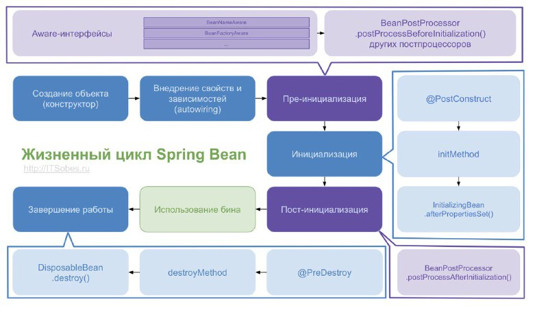
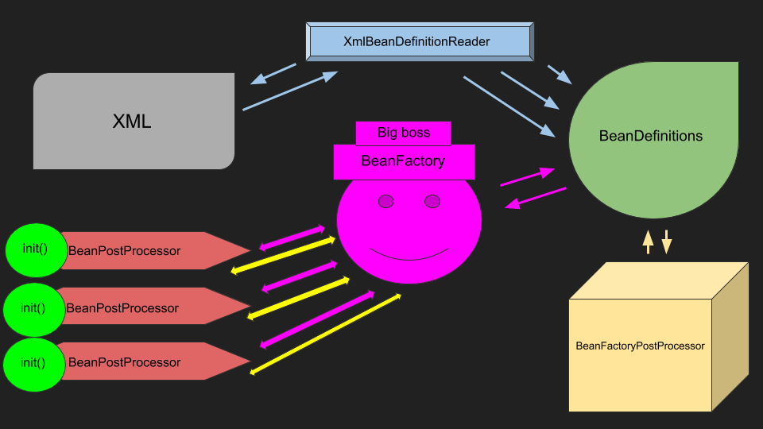

# Spring lifecycle
## Профессия Java-разработчик на Hexlet
### Преподаватель: Яковлев Егор
<!-- _color: white -->
<!-- _color: white -->

---

# Вопросы к лекции:

* Что такое BeanDefinition?
* FactoryBean vs BeanFactory?
* Что такое BeanPostProcessor?

---

# План

1. Spring licecycle
2. Создание объекта бина
3. BeanDefinition
4. BeanPostProcessor

---

# Spring lifecycle

---

# Spring lifecycle

---

# Создание объекта

1. Парсинг конфигурации
2. Создание BeanDefinition

---

# BeanDefinition

BeanDefinition – это специальный интерфейс, через который можно получить доступ к метаданным будущего бина. В зависимости о того, какая у вас конфигурация, будет использоваться тот или иной механизм парсирования конфигурации

---

# AnnotatedBeanDefinitionReader

1. Регистрация всех @Configuration для дальнейшего парсирования
2. Регистрация специального BeanDefinitionRegistryPostProcessor, который при помощи класса ConfigurationClassParser парсирует JavaConfig и создаёт BeanDefinition

---

# Настройка созданных BeanDefinition

postProcessBeanFactory

**Демо**

---

# FactoryBean

FactoryBean – это generic интерфейс, которому можно делегировать процесс создания бинов типа.

Для тех, кто пользуется JavaConfig, этот интерфейс будет абсолютно бесполезен

---

# BeanPostProcessor

На этом этапе экземпляр бина уже создан и идёт его донастройка
