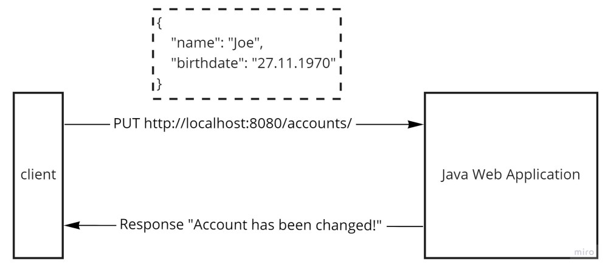

# CRUD - in memory
## Профессия Java-разработчик на Hexlet
### Преподаватель: Яковлев Егор
<!-- _color: white -->
<!-- _color: white -->

---

# Вопросы к лекции:

* Что означает аббревиатура CRUD?
* В чём особенность реализации CRUD in memory?
* Как реализовать модель CRUD in memory с помощью сервлетов?

---

# План

1. CRUD
2. Create
3. Read
4. Update
5. Delete

---

# CRUD

CRUD — понятие, обозначающиее четыре базовые функции, используемые при работе с базами данных (приложением): создание, чтение, модификация, удаление.

---

# Create


---

# Read


---


# Update



---

# Delete


---

# CRUD

**Демо**

---


# Домашнее задание

```bash
hexlet program download java crud-in-memory
hexlet program submit java
```

---

# Вопросы?