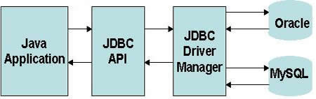

# JDBC
## Профессия Java-разработчик на Hexlet
### Преподаватель: Яковлев Егор
<!-- _color: white -->
<!-- _color: white -->

---

# Вопросы к лекции:

* Что такое JDBC?
* Как удаётся писать код один раз, но базы использовать разные?
* Что такое динамический SQL?

---

# План

1. JDBC
2. Основные компоненты
3. Демо

---

# JDBC

Java Database Connectivity (JDBC) - это стандартный API для взаимодействия с реляционными базами данных

---

# JDBC схема



---

# Основные компоненты JDBC

* Driver – интерфейс, использующийся для соединения и коммуникации с базой данных
* DriverManager – управляет списком драйверов
* Connection – интерфейс со всеми методами связи с базой данных
* Statement – интерфейс, включающий команду SQL отправленный в базу данных для анализа, обобщения, планирования и выполнения
* ResultSet – представляет набор записей, извлечённых при выполнении запроса

---

# Домашнее задание

```bash
hexlet program download java jdbc
hexlet program submit jdbc
```

---

# Вопросы?
