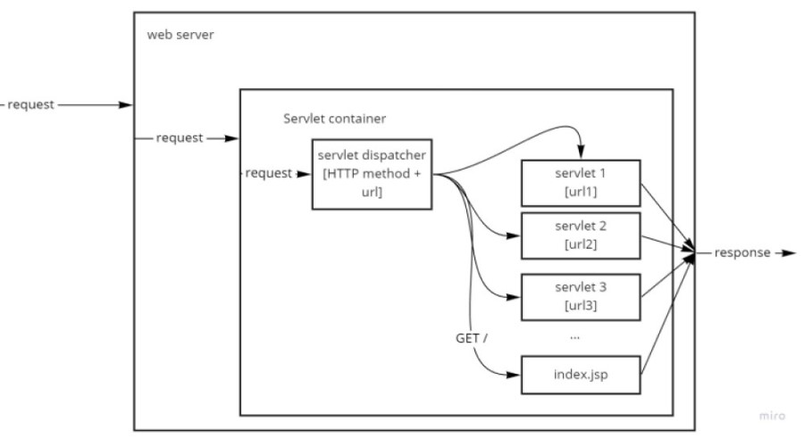

# Servlet
## Профессия Java-разработчик на Hexlet
### Преподаватель: Яковлев Егор
<!-- _color: white -->
<!-- _color: white -->

---

# Вопросы к лекции:

* Что такое сервлет?
* Как устроены сервлеты?
* Как написать свой сервлет?

---

# План

1. Сервлет
2. URL
3. Кто управляет сервлетами?
4. Жизненый цикл сервлета?
5. Как проходит запрос?
6. Создаём сервлет

---

# Сервлет

Сервлет (Servlet) - это java-класс, который принимает HTTP запросы, обрабатывает их и отправляет ответ (HTTP response).

---

# URL

* URL - это веб-адрес, используемый для идентификации ресурсов в интернете. Пример URL: www.localhost:8080 **/users/**
* PathVariables: www.localhost:8080/users/ **122** /
* RequestParam: www.localhost:8080/users/? **age_min=18**

---

# Кто управляет сервлетами?

Контейнер сервлетов (Servlet container)

request -> web server -> servlet container -> servlet

---

# Жизненный цикл сервлета

1. Загрузка класса сервлета
2. Создание инстанса класса сервлета
3. вызов init() - инициализация (вызывается метод единожды)
4. вызов service() - обработка запроса и выброс ответа (вызов методов doGet(), doPost() и т.п.)
5. destroy() - "закрытие" сервлета (вызывается только один раз)

---

# Как проходит запрос?



---

# Создаем сервлет

* dependency javax.servlet:javax.servlet-api
* @WebServlet()
* extends HttpServlet

**Демо**

---

# Домашнее задание

```bash
hexlet program download java servlets
hexlet program submit java
```

---

# Вопросы?
