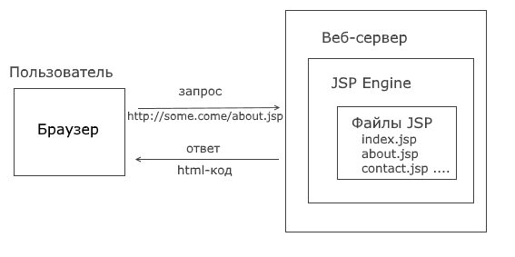

# Template
## Профессия Java-разработчик на Hexlet
### Преподаватель: Яковлев Егор
<!-- _color: white -->
<!-- _color: white -->

---

# Вопросы к лекции:

* Что такое шаблонизатор?
* Что такое JSP?
* Как создать JSP?

---

# План

1. Шаблонизатор
2. JSP
3. Возможности JSP
4. Структура JSP

---

# Шаблонизатор

* Шаблон – Файл, содержащий HTML и некоторые маркеры, позволяющий этот шаблон обработать и сформировать на его основе конечный HTML код.
* Шаблонизатор – осуществляет обработку шаблона.

---

# JSP

* JSP (Java Server Pages) — это технология Java, которая позволяет создавать динамические веб-страницы для Java приложений.

---

# Возможности JSP

* получать данные из веб-страницы в Java-код
* отправлять данные из Java кода на веб-страницу
* писать Java-код, прямо внутри html

---

# Принцип работы JSP



---

# Структура JSP

* статическая часть: формируется за счет HTML
* динамическая чать: генерируется с помощью Java

---

# JSP

**Демо**

---


# Домашнее задание

```bash
hexlet program download java jsp
hexlet program submit java
```

---

# Вопросы?
