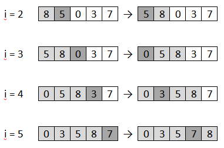
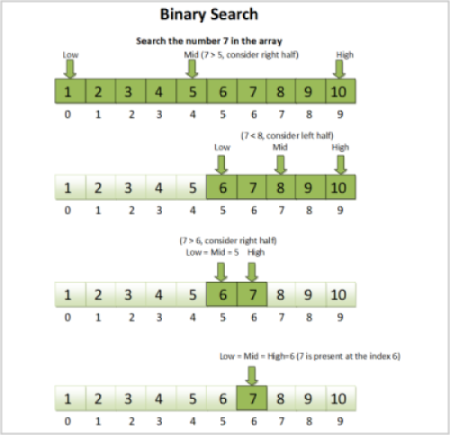
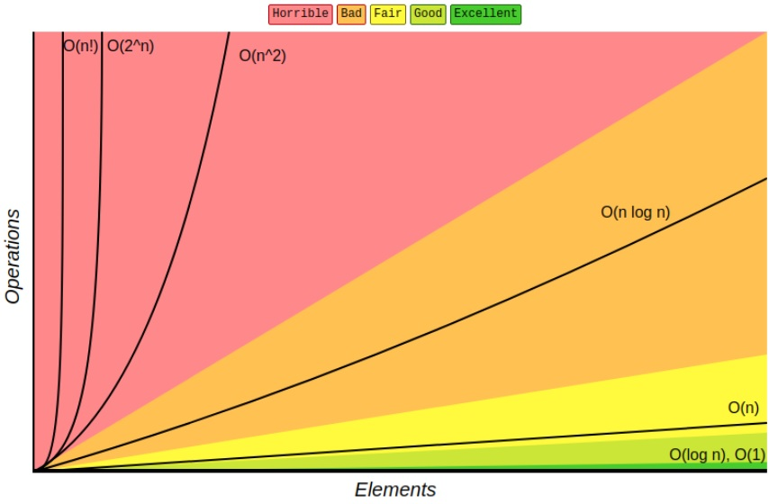
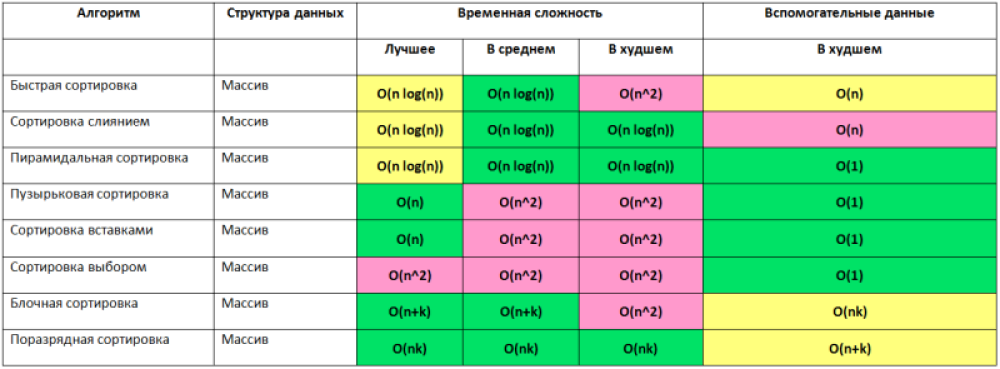

# Алгоритмы
## Профессия Java-разработчик на Hexlet
### Преподаватель: Яковлев Егор
<!-- _color: white -->
<!-- _color: white -->

---

# Вопросы к лекции:

* Что такое алгоритм?
* Как найти элемент в массиве? 
* Как отсортировать массив?
* Как можно еще найти элемент в массиве?
* Как определить эффективность алгоритма?

---

# План

* алгоритм
* поиск значения в массиве
* сортировка массива
* бинарный поиск
* сложность алгоритма

---

# Алгоритм

> **Алгоритм** - набор инструкций, описывающий порядок действий исполнителя для достижения результата решения задачи за конечное число действий

Википедия

---

# Алгоритм: примеры

* Рецепт пирога - некоторая свобода действий

А вот тут всё строже...

* Инструкция по сборке мебели 
* Процедура оформления кредита в банке

---

# Алгоритм

**Компьютерный** алгоритм:
- чётко описан
- чётко выполнен

---

# Примеры компьютерных алгоритмов

* поиск значения в массиве

**Демо**

---

* сортировка массива: сортировка вставками



**Демо**

---


* поиск: бинарный поиск



**Демо**

---

# Сложность алгоритмов

Задача: реализовать поиск элемента в массиве

* мы рассмотрели два варианта: через перебор всех значений и бинарный поиск
* решают ли эти два алгоритма задачу? - **Да**
* но вопрос - какое из этих двух решений лучше? Какой алгоритм **эффективнее**?

---

# Сложность алгоритмов

Пример задачи: узнать, где живёт друг

Предлагаю два варианта. Какой эффективнее?

*  можно обойти все дома и квартиры в городе, стучаться в каждую дверь и спрашивать, кто живёт там
* можно спросить у друга...

* А если в городе число домов увеличится вдвое?

---

# Сложность алгоритмов

**Big-O** - большая О - оценка сложность сложности алгоритмов - как сильно увеличится количество операций при увеличении размера данных

---



---


["Big-O"](https://ru.hexlet.io/courses/java-arrays/lessons/about-O/theory_unit)

---

# Домашнее задание

```bash
hexlet program download java algorithms
hexlet program submit java algorithms
```

---

Грокаем алгоритмы. Иллюстрированное пособие для программистов и любопытствующих | Бхаргава Адитья


---


# Вопросы?