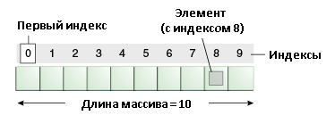

# Массивы
## Профессия Java-разработчик на Hexlet
### Преподаватель: Яковлев Егор
<!-- _color: white -->
<!-- _color: white -->

---

# Вопросы к лекции:

1. Как хранить набор данных?
2. Как создавать массив в Java?
3. Как заполнять и получать данные из массива?
4. Как обрабатывать таблицы (матрицы) с помощью массива?

---

# План

1. Что такое массив?
2. Как создавать массив?
3. Заполнение массива
4. Получение элеметов массива
5. for-each и печать элементов массива
6. Массив как аргумент метода и возвращаемое значение
7. Одномерные и многомерные массивы

---

# Что такое массив?

Примеры:

* Список учеников в классном журнале
* Меню в ресторане
* Коллекция одежды

---

# Что такое массив?

Массив — это структура данных, в которой хранятся элементы одного типа.

**Демо плохого примера хранения данных**

---

Его можно представить как набор пронумерованных ячеек, в каждую из которых можно поместить данные.



---

# Как создавать массив?

```java
int [] array = new int[10] // best practice; 10 elements

String arrayOfString[] = new String[5]; // NOT JAVA STYLE; 5 elements
```

Ключевое слово **new**

Демо

---

# Заполнение массива

```java
int[] arr = new int[3];
// индексы начинаются с нуля
arr[0] = 1;
arr[1] = 2;
arr[2] = 3;
```

Демо

---

# Получение элементов массива

```java
System.out.println("Первый элемент массива " + arr[0]);
System.out.println("Второй элемент массива " + arr[1]);
System.out.println("Третий элемент массива " + arr[2]);
```

Демо

---

# Печать элементов массива

Способ № 1

```java

for (int i = 0; i < arr.length; i++) {
    System.out.println("element № " + i + ": " + arr[i]);
}

```

Демо

---

Способ № 2

```java

for (int i: arr) {
    System.out.println("element of arr " + i);
}

```

Демо


---

Способ № 3

```java

int[] arr = new int[3];
arr[0] = 1;
arr[1] = 2;
arr[2] = 3;

System.out.println(Arrays.toString(arr));

```

---

# Многомерный массив 

"Массив массивов"

Демо

---

# Домашнее задание

```bash
hexlet program download java arrays
hexlet program submit java
```

---

# Вопросы?

---
